  

  <h3>你好，我是 remember11 👋</h3>
  
Developer focused on AI applications, developer tools and thoughtful product experiences.

  

    <a href="https://github.com/SteinsHead?tab=repositories">Projects</a>
    &nbsp;·&nbsp;
    <a href="https://steinshead.github.io">Blog</a>
    &nbsp;·&nbsp;
    <a href="mailto:headsteins@gmail.com">Email</a>
  

 

## 👋 About

我喜欢把复杂问题拆成清晰的界面与可靠的工程实现，把好奇心变成真正可以运行、可以被使用的东西。

- 🛠️ 打磨本地优先、尊重用户数据的开发者工具
- 🧠 从零学习语言模型，并把知识做成可交互的体验
- ✨ 在意产品细节，也在意安全、可维护性与真实使用场景

## 🚀 Featured work

<table>
  <tr>
    <td width="50%" valign="top">
      <strong><a href="https://github.com/SteinsHead/ghostty-studio">Ghostty Studio</a></strong>
       
      可视化编辑 Ghostty 配置；保留原文件结构，保存前确认差异。
        
      <code>Rust</code> <code>Tauri</code> <code>TypeScript</code>
    </td>
    <td width="50%" valign="top">
      <strong><a href="https://github.com/SteinsHead/cs336-learning-platform">CS336 Learning Platform</a></strong>
       
      从零学习语言模型的交互式平台，串联理论、数学、代码与实验。
        
      <code>Python</code> <code>JavaScript</code> <code>GitHub Pages</code>
    </td>
  </tr>
  <tr>
    <td width="50%" valign="top">
      <strong><a href="https://github.com/SteinsHead/Luna">Luna</a></strong>
       
      面向 Web 与 Android 的跨端 monorepo 实践与个人产品探索。
        
      <code>TypeScript</code> <code>Monorepo</code> <code>Cross-platform</code>
    </td>
    <td width="50%" valign="top">
      <strong><a href="https://github.com/SteinsHead/Life-Copilot">Life Copilot</a></strong>
       
      用自然语言与语音捕捉任务的跨端产品实验。
        
      <code>Expo</code> <code>React Native</code> <code>AI</code>
    </td>
  </tr>
</table>

## 🧰 Toolbox

| Languages | Building with | Focus |
| :--- | :--- | :--- |
| `TypeScript` · `Rust` · `Python` · `Go` | `React` · `Tauri` · `Node.js` · `Expo` | AI apps · Developer tools · Learning systems |

 

> **Clear interfaces. Reliable systems.** Small iterations that become useful products.

  Static by design — fast, reliable, and free from third-party stats services.

